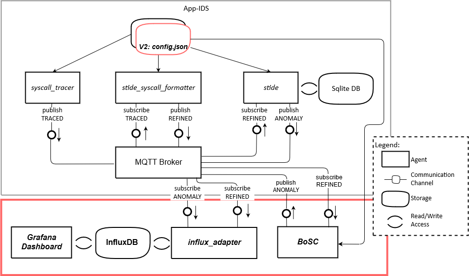

# The config.json

As of version 2.0, the configuration now consists of a single JSON file that should be consistent across all of the deployed modules.
As we've currently only tested deployment on a single machine there were obviously no consistency issues.



An example config could look as follows:

```
{
    "stide": {
      "DB_USER": "",
      "DB_PW": "",
      "DB_HOST": "../Traces.sqlite",
      "BROKER_IP": "test.mosquitto.org",
      "STORAGE_MODE": "True",
      "WINDOW_SIZE": 3
    },
    "syscall_tracer": {
      "BROKER_IP": "test.mosquitto.org",
      "PID": 1,
      "PNAMES": [ "python", "attack" ],
      "QOS": 1
    },
    "stide_syscall_formatter": {
      "BROKER_IP": "test.mosquitto.org"
    },
    "BOSC": {
      "DB_USER": "",
      "DB_PW": "",
      "DB_HOST": "../Traces.sqlite",
      "BROKER_IP": "test.mosquitto.org",
      "LEARNING_MODE": "True",
      "WINDOW_SIZE": 3
    },
    "influx_adapter": {
      "BROKER_IP": "test.mosquitto.org",
      "INFLUX_HOST": "",
      "INFLUX_PORT": "",
      "INFLUX_MSRMNT": ""
    },
    "create_LUT": {
      "BROKER_IP": "test.mosquitto.org"
    }
  }
```

Note that each module has its own, separate block of configuration keys and requires to be configured individually.  
The configuration keys "DB_USER" and "DB_PW" are meant to be used with the SQLite database if it requires user authentication of some sort.  
The SQLite and Influx databases might as well be deployed somewhere online but we assume you use local installations of each one for performance reasons. 
